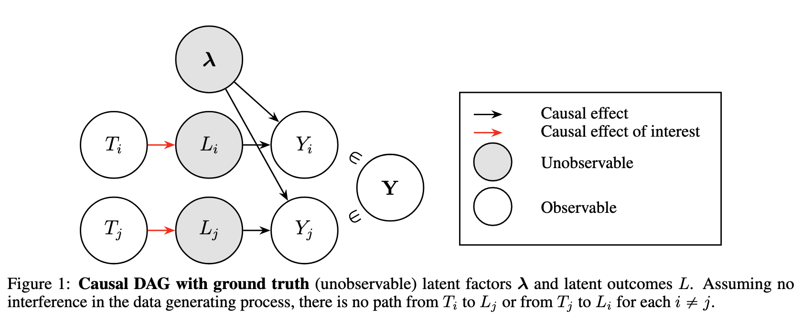

# Reading Note: Causal Inference for Latent Outcomes Learned With Factor
Models
Ming Yuan
2025-10-04

> [Landy, Jenna M., et al. “Causal Inference for Latent Outcomes Learned
> with Factor Models.” arXiv preprint arXiv:2506.20549
> (2025).](https://arxiv.org/abs/2506.20549)

## Summary

This paper introduces methods for causal inference when outcomes are
latent variables estimated via factor models. The authors develop
statistical techniques to construct valid confidence intervals for
treatment effects on these latent outcomes, accounting for uncertainty
from both the factor model estimation and the causal inference
procedure. The approach is demonstrated through simulations and real
data, showing improved inference compared to naive methods that ignore
latent variable uncertainty.

## Motivation & Problem Setting

- In many domains (genomics, NLP, social science, economics), we often
  work with high-dimensional observed data and compress orsummarize it
  via factor models or representation learning to obtain latent
  outcomes.
- One may wish to ask causal questions about these latent outcomes,
  i.e., how a treatment affects a latent factor.
- A key challenge arises: when you learn the latent outcomes jointly
  across individuals (e.g. matrix factorization), the estimated latent
  outcome for one individual may depend (through the factorization) on
  other individuals’ data and treatments. This violates the usual *no
  interference* assumption in causal inference. The authors call this
  phenomenon **learning-induced interference**.
- The paper aims to provide a framework and estimator for causal effects
  on such latent outcomes, accounting for and mitigating
  learning-induced interference.

## Key Concepts & Contributions

### 1. Formalizing learning-induced interference

- The authors distinguish learning-induced interference (due to the
  joint estimation procedure) from “data-generating interference” (true
  spillovers in the underlying causal process)

- They articulate conditions under which standard causal inference
  assumptions (like no interference) may fail when using latent
  representations.

- The authors “focus on nennegative matrix factorization (NMF), a factor
  modeling technique for decomposing nonnegative data into nonnegative
  factors and weights”.

- ### 2. Causal estimand for latent outcomes

- Their target is an average treatment effect defined at the level of
  latent means (rather than on observed outcome).

``` markdown

```
