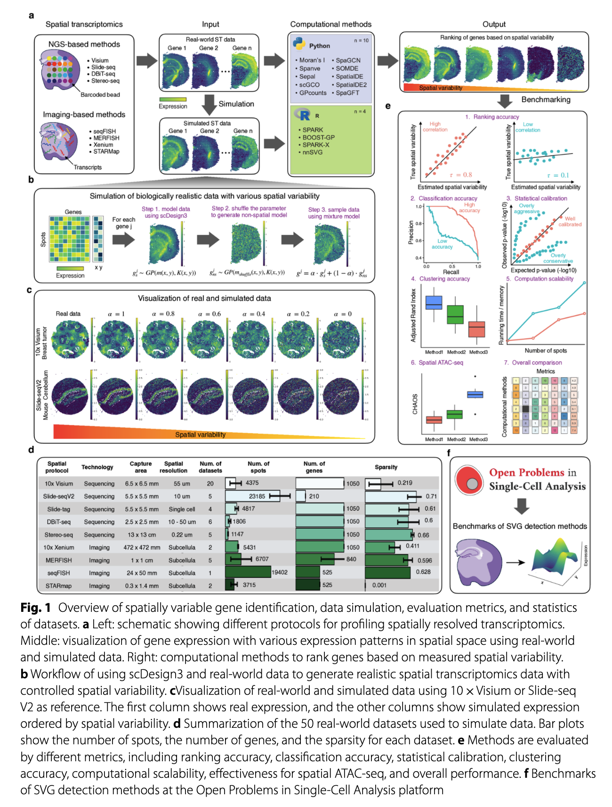

# Reading note: identify spatially variable genes in spatial
transcriptomics data
Ming Yuan
2025-09-25

## Reference

> [Li, Zhijian, et al. “Systematic benchmarking of computational methods
> to identify spatially variable genes.” *Genome Biology* 26.1 (2025):
> 285.](https://genomebiology.biomedcentral.com/articles/10.1186/s13059-025-03731-2)

## Summary

This paper presents a comprehensive benchmarking of computational
approaches for identifying spatially variable genes (SVGs) in spatial
transcriptomics data. The authors evaluate multiple methods across
diverse datasets, considering accuracy, robustness, and computational
efficiency. Key findings highlight the strengths and limitations of
popular algorithms, providing guidance for method selection in spatial
transcriptomics studies.

## Key Points

- Benchmarked methods include spatialDE, trendsceek, SPARK, and others.
- Evaluation criteria: detection accuracy, reproducibility, scalability.
- Recommendations for best practices in SVG identification.
- Discussion of challenges in spatial transcriptomics analysis.

## Personal Notes (copied from the paper)

- A task for all spatial transcriptome (ST) profiles is to identify
  genes that show significant association between the spatial
  distribution of the cells and their expression levels.

  - These genes are defineds as spatially variable genes (SVGs).
  - Identifying SVGs from ST data has helped researchers better
    understand developmental gradients, cell signaling pathways, and
    tumor microenvironments.

- The identification of spatial variable genes (SVGs) in spatial
  transcriptomics data requires computational methods that integrate
  both **gene expression levels** and **spatial information** (cellular
  or subcellular level).

- Sequencing-based spatial transcriptome profiling methods:

  - [Slide-seq](https://www.science.org/doi/abs/10.1126/science.aaw1219);
    [10x Genomics
    Visium](https://www.science.org/doi/abs/10.1126/science.aaf2403);
    [High-Definition Spatial Transcriptomics
    (HDST)](https://www.nature.com/articles/s41592-019-0548-y)

  - Provide genome-wide gene expression measurements through spots
    profiling multiple cells, thus precluding the possibility of
    delineating expression at the single-cell level.

  - > “Spot profiling”: gene expression is measured at discrete
    > spatially barcoded locations (“spots”) on a tissue section. Each
    > spot captures RNA from multiple cells within its area, allowing
    > researchers to map gene expression patterns across the tissue.
    > However, because each spot may contain transcripts from several
    > cells, the resulting data represents an aggregate signal rather
    > than single-cell resolution.

- Image-based spatial transcriptome profiling methods:

  - [SeqFISH+](https://www.nature.com/articles/s41587-019-0290-y);
    [MERFISH](https://www.science.org/doi/10.1126/science.aaa6090)
  - Able to generate sub-cellular resolution data but can only detect a
    subset of genes (30-300).

## Additional Notes

- The paper provides a detailed evaluation of these methods, including
  their performance in detecting true spatially variable genes and their
  robustness to noise and missing data.
- The authors also discuss the importance of spatial context in gene
  expression analysis and the potential for integrating spatial
  information with other omics data.
