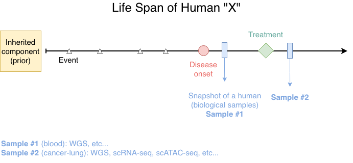
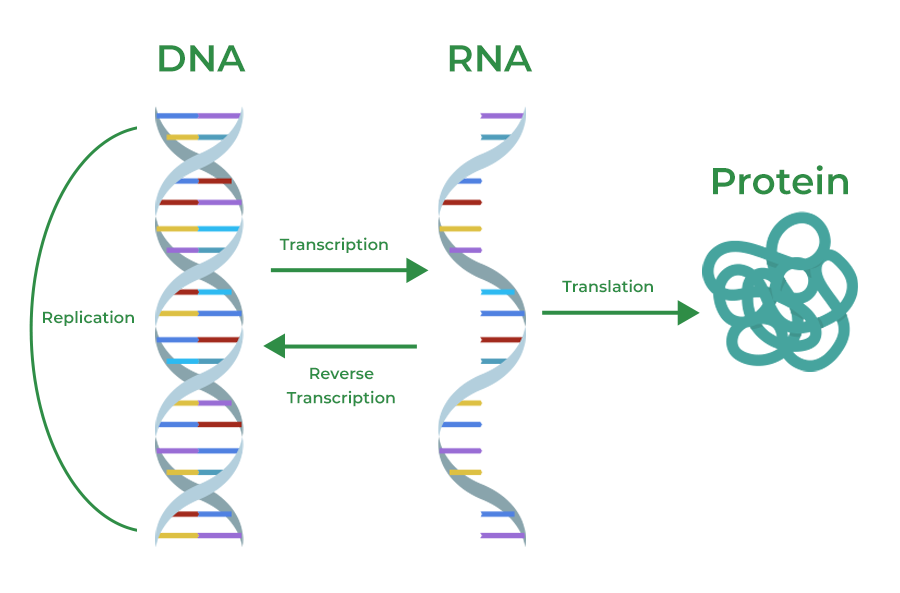
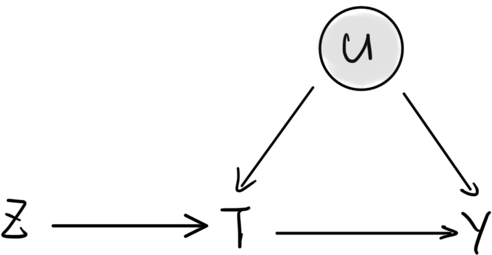

> All information is the summary from google/perplexity. Here is just a brief overview of the biological concepts.

From the perspective of a student majoring in statistics, this is a brief overview of concepts commonly encountered in multiomic studies.

## Figure of Overview

Thanks to Maxwell, who taught me a lesson of the following basic concepts of multiomics.

{#origin-of-samples width="500"}

And, review the central dogma, i.e., the route of gene expression(?):

[{width="450"}](https://www.geeksforgeeks.org/biology/central-dogma-steps-guide/)

-   **DNA** related: *ATAC-seq* (assay for transposase-accessible chromatin using sequencing, epigenetic), *WGS* (whole genome sequencing), eQTL (expression quantitative trait locus), etc...

-   **RNA** related: *RNA-seq*, spatial transcriptomics, etc...

-   **Protein** related: Proteomics, etc...

------------------------------------------------------------------------

## Concepts

Thanks to LLM tools that explain and summarize the following contents.

### 0. Chromosome

#### 0.1 Chromatin accessibility

Chromatin accessibility refers to how open or compact a cell's DNA is, determining if regulatory proteins like transcription factors can access specific genes to turn them on or off, essentially controlling gene expression.

-   **Structure**: DNA is wrapped around histone proteins (组蛋白) to form nucleosomes (核小体), creating chromatin. Accessibility depends on how densely these nucleosomes are packed.

-   **Regulation**: Open regions lack nucleosomes or have them loosely packed, allowing machinery like RNA polymerase (聚合酶) and transcription factors (TFs) (转录因子) to bind.

-   **Function**: It is crucial for **gene regulation**; accessible sites at promoters and enhancers signal active gene expression, while inaccessible regions are silenced.

-   **Dynamics**: Chromatin accessibility isn't static; it changes rapidly in response to developmental cues and environmental signals, allowing cells to adapt.

It can be measured by techniques like **ATAC-seq** , and DNase-seq and FAIRE-seq.

Significance:

-   Understanding chromatin accessibility helps map regulatory elements (like enhancers and promoters) and understand how they control gene expression.

-   It's vital for studying cell differentiation, disease development, and how different cells (like immune cells) respond to signals.

#### 0.2 ATAC-seq

Assay for Transposase-Accessible Chromatin using sequencing.

-   Maps *open regions of chromatin* across the genome to study *gene regulation.*

-   Identifies regulatory elements like promoters and enhancers, tracks nucleosome positioning, and reveals transcription factor binding.

-   Single-cell versions (*scATAC-seq*) enable cell-type clustering and integration with RNA-seq for multi-omics insights.

DATA ANALYSIS:

-   ...

### 1. DNA related

#### 1.2 eQTL

Expression Quantitative Trait Locus

-   *A position in the genome where genetic variation* is statistically associated with differences in *gene expression levels (typically mRNA abundance)* across individuals.

-   A special case of a QTL, but the "trait" being mapped is gene expression rather than a higher-level phenotype like height or disease status.

    -   **QTL, quantitative trait loci**, are specific **regions on a chromosome** associated with variation in complex traits (like height, yield, or disease risk) that are influenced by multiple genes and the environment, rather than a single gene.

        -   *Quantitative traits*: traits that show a continuous range of variation within a population (e.g., weight, blood pressure, crop yield), unlike simple Mendelian traits (e.g., flower color).

        -   *Polygenic*: influenced by multiple genes (poly-), each with a small effect, interacting with environmental factors.

        -   *Locus (plural: loci)*: a specific location on a chromosome.

    -   Statistical analysis, i.e., QTL mapping: statistical tests link specific DNA marker (like SNPs) locations on the map to variations in the measured trait.

    -   Identification: regions where markers constistently show association with the trait are identified as QTLs, revealing potential gene controlling that trait.

-   In practice, an eQTL is usually a specific variant (often a SNP) whose genotype correlates with how much a given gene is expressed.

DATA ANALYSIS (how eQTLs are mapped):

-   Researchers measure genome-wide genotypes and gene expression (e.g. by RNA-seq) in many individuals and test, typically with regression, whether **variant genotype** is associated with **expression of each gene (e.g. by RNA-seq)**.

-   Significant associations that pass *multiple-testing* correlation are called eQTLs. Large projects like GTEx and eQTLGen provide catalogs of these variant-gene links across many human tissues.

Why eQTLs matter:

-   Help **connect *noncoding GWAS* hits to the genes they** **regulate**, acting as a bridge from genetic variants to changes in gene regulation and then to disease or complex traits.

-   Used to ***build gene regulatory networks***, prioritize candidate causal genes, and power methods like transcriptome-wide association studies (TWAS) that infer expression-trait relationships.

#### 1.3 WGS

Whole genome sequencing

-   a method to read essentially all of an organism's DNA, including both coding and non-coding regions, to capture a comprehensive picture of its genetic information.

-   WGS determines the entire sequence of chromosomal DNA and usually mitochondrial (线粒体) DNA (and chloroplast (叶绿体) DNA in plants) in one experiment.

DATA ANALYSIS:

-   

Main Application:

-   In medicine, WGS is used to diagnose rare genetic diseases, characterize cancers, and support precision medicine by identifying clinically relevant variants.

-   In research and public health, it underpins population genomics, evolution studies, microbial surveillance, and outbreak tracking by comparing genomes across many samples.

### 2. RNA related

.....

### 3. Protein related

...

------------------------------------------------------------------------

## Words

### 1. 遗传性的 (Hereditary / Inherited)

This refers to traits or mutations passed from parents to offspring through the germline (生殖细胞).

-   ***Hereditary***: the most common term for diseases or traits that run in families (e.g., hereditary cancer).

-   **Germline**: used specifically to describe mutations present in egg or sperm cells that can be passed to future generations.

-   **Inherited**: often used interchangeably with hereditary to describe genetic material passed down.

-   **Congenital**: not that while this means "present at birth", it is not always synonymous with hereditary; some congenital condition are non-genetic (e.g., caused by infection during pregnancy).

### 2. 非遗传性的 (Non-hereditary / Acquired)

This refers to traits or mutations that occur after conception and are not passed to offspring.

-   ***Somantic***: the most precise genomic term for mutations that occur in any cells of the body except the germ cells (e.g., somatic mutations in a tumor).

-   **Aquired**: frequently used in clinical settings to describe conditions that develop during a person's lifetime rather than being inherited.

-   **Sporadic**: used when a disease (like a certain type of cancer or Alzeimer's) occurs in an individual without a family history or a known inherited genetic mutation.

-   **Non-hereditary/Non-inherited**.

3.  

------------------------------------------------------------------------

## Explanations of Commomly Encountered Methods

### 1. Fine-mapping

Fine-mapping refines broad genomic association signals from GWAS or QTL studies down to a small **credible set** of variants most likely to be causal, by leveraing linkage disequilibrium (LD) structure, statistical modeling, and sometimes functional annotations.

**Statistical approaches**

-   **Bayesian methods** (e.g. FINEMAP, SuSiE, CAVIAR): model multiple causal variants explicitly, compute PIPs for each variant given summary statistics and an LD reference, and sample or approximate over possible causal configurations.

-   **Penalized regression** (e.g. via LASSO or nonlocal priors like piMOM): performs variable selection directly on effect sizes, shrinking non-causal variants to zero.

-   **Heuristic support**: measures approximate Bayes factors from p-values under a single-causal assumption, ranking variants by how much they explain the signal after conditioning on others.

**Key inputs and challenges**

-   Requires *GWAS summary statistics* (effect sizes, standard errors), an *LD matrix* from a reference panel matching the study population, and sometimes multi-ancestry data to exploit LD differences (e.g. shorter LD in African ancestries improves resolution).

-   Challenges include multiple causal variants, LD inaccuracies from reference mismatch, population structure bias, and weak signals; multi-trait or functional priors (e.g., chromatin marks) boost accuracy.

### 2. Colocalization

-   Colocalization in **statistical genetics/functional genomics** is often a task of **causal inference**

    > "Are two association signals (e.g. a GWAS hit and an eQTL peak) driven by the same causal variant?"
    >
    > Or, in other words
    >
    > "Do two traits share a causal SNP in a genomic region?"

-   If a GWAS association colocalizes with an eQTL signal, it supports:

    -   that the gene's expression mediates the trait

    -   prioritizing causal genes

    -   improving biological interpretation

-   In general statistics, colocalization can refer to two point processes or spatial patterns occuring near the same locations.

### 3. Mendelian randomization (MR)

MR uses genetic variants as instrumental variables to infer causal effects of a modifiable exposure (e.g. BMI or cholesterol levels) on an outcome (like disease risk) from observational data, mimicking a randomized controlled trial by leveraging random assortment of alleles during meiosis (减数分裂，即生殖细胞的形成过程).

**Core assumptions**

-   Notations:

    -   $Z$ : **instrument**, e.g. genetic variants: cis-eQTL SNPs for gene expression or caQTL SNPs for chromatin accessibility. They are randomly allocated at meiosis (减数分裂) and fixed at conception (受孕).

    -   $T$: **treatment/exposur**e, e.g. modifiable risk factor or molecular trait of interest, such as LDL cholesterol, BMI, gene expression levels from an eGene, or chromatin accessibility at a regulatory peak.

    -   $Y$: **outcome**, e.g. downstream phenotype or disease trait,

    -   $U$: *unobserved* **confounder**

**IV assumptions** for genetic instrument, typically SNPs strongly associated with the exposure:

-   **Relevance**: the variant $Z$ robustly/strongly affects exposure levels $T$;

-   **Independence**: no confounding between variant $Z$ and outcome $Y$ except through the exposure $T$; i.e., $Z$ must be independent of any unmeasured confounders $U$ that affects both $T$ and $Y$.

-   **Exclusion restriction**: the variant $Z$ influences the outcome $Y$ only via the exposure $T$, not through other pathways (e.g. pleiotropy 基因多效性).

**Core structure**

{fig-align="center" width="450"}

-   $Z$ associates with $T$ but remains independent of $U$, and thus regressing $T$ on $Z$ ( $T$ \~ $Z$) isolates exogeneous variation in $T$ unaffected by confounding.

#### IV analysis: two-stage least squares (2SLS)

For linear models,

**Stage 1**: Regress (each column of) $T$ on $Z$ ( $T = Z \delta + \epsilon_t$ ):

$$
\hat{\delta} = (Z^\top Z)^{-1} Z^\top T,
$$

and save the predicted values:

$$
\hat{T} = Z \hat{\delta} = Z (Z^\top Z)^{-1} Z^\top T = P_Z T.
$$

**Stage 2**: Regress $Y$ on the predicted values from the first stage:

$$
Y = \hat{T} \beta + \epsilon_y,
$$

which gives

$$
\hat{\beta}_{2SLS} 
= (\hat{T}^\top \hat{T})^{-1} \hat{T}^\top Y 
= (T^\top P_ZT)^{-1} T^\top P_Z Y.
$$

### 4. Peak calling - ATAC-seq

-   **Peak calling**: a computational method used to **identify regions of the genome where there is a significant "signal" in sequencing data**; check which part of chromatin "opens" - chromatin accessible.

    -   You sequence millions of DNA fragments and map them back to the genome. Some region will have

        -   Many reads piled up = "open" chromatin (accessible)

        -   Fewer or no reads = "closed" chromatin (not accessible)

    -   Peak calling algorithm tries to find where those "piles" of reads are - these piles are called **peaks**;

    -   **Peaks** = genome whose read counts are significantly higher than the background; likely regulatory elements (promoters, enhancers, etc.)

-   Traditional approach:

    1.  Call peaks across all cells
    2.  Count accessibility in those peaks
    3.  Correlate peak accessibility with gene expression

-   Problems of peak calling:

    -   Peak calling needs enough signal (reads) to detect peaks

    -   Rare cell types might not have enough cells to call peaks reliably

    -   Might miss important regulatory regions

-   SCARlink's solution:

    -   Skip peak calling entirely and use fixed 500 bp tiles everywhere;

    -   Let the statistical model figure out which tiles matter.

    -   More agnostic: no need to pre-deciding what's important based on peak calling thresholds.
